<div align="center">

# 📖 Personal Diary App


### ✨ A beautiful, secure, and feature-rich personal diary application

*Capture your thoughts, memories, and experiences with style and privacy*

[🚀 Quick Start](#-quick-start) • [✨ Features](#-features) • [🛠️ Setup](#️-setup-guide) • [📱 Demo](#-how-it-works)

---

</div>

## 🎯 What is Personal Diary App?

Personal Diary App is a modern, web-based journaling platform that combines the intimacy of a personal diary with the power of modern web technologies. Built with security and user experience in mind, it provides a safe space for you to document your daily thoughts, experiences, and memories.

### 🌟 Why Choose Our Diary App?

- **🔒 Privacy First**: Your entries are secured with Row Level Security (RLS)
- **🎨 Beautiful Design**: Clean, modern interface with smooth animations
- **🌙 Adaptive Themes**: Seamless dark/light mode switching
- **📱 Responsive**: Works perfectly on desktop, tablet, and mobile
- **⚡ Real-time**: Instant updates across all your devices
- **🔍 Smart Search**: Find any entry quickly with powerful search
- **🏷️ Organization**: Tag system to categorize your thoughts
- **💾 Auto-save**: Never lose your thoughts with automatic saving

## ✨ Features

<table>
<tr>
<td width="50%">

### 🔐 **Secure Authentication**
- Email/password authentication via Supabase
- Secure session management
- Password reset functionality
- Email verification

### 📝 **Rich Writing Experience**
- Markdown support for formatting
- Auto-save functionality
- Character and word count
- Distraction-free writing mode

</td>
<td width="50%">

### 🎨 **Beautiful Interface**
- Smooth animations with Framer Motion
- Dark/light theme toggle
- Responsive grid layout
- Intuitive navigation

### 🔍 **Smart Organization**
- Full-text search across all entries
- Tag-based categorization
- Date-based filtering
- Sort by creation or update time

</td>
</tr>
</table>

## 📱 How It Works

<div align="center">

### 🎬 User Journey

```mermaid
graph TD
    A[🚀 Sign Up/Login] --> B[📝 Create Entry]
    B --> C[🏷️ Add Tags]
    C --> D[💾 Auto Save]
    D --> E[🔍 Search & Browse]
    E --> F[✏️ Edit Anytime]
    F --> G[🌙 Switch Themes]
    G --> H[📱 Access Anywhere]
```



</div>

### 🔄 App Workflow

1. **🔐 Authentication**: Secure sign-up/login with email verification
2. **📝 Writing**: Create entries with rich text and markdown support
3. **🏷️ Tagging**: Organize thoughts with custom tags
4. **💾 Storage**: Automatic saving to secure cloud database
5. **🔍 Discovery**: Search and filter entries by content, tags, or date
6. **🎨 Personalization**: Switch between light and dark themes
7. **📱 Accessibility**: Access from any device, anywhere

## 🚀 Quick Start

### Prerequisites

<table>
<tr>
<td>

**Required:**
- Node.js 18+
- npm or yarn
- Supabase account

</td>
<td>

**Recommended:**
- VS Code
- Git
- Modern browser

</td>
</tr>
</table>

### ⚡ Installation

```bash
# 1. Clone the repository
git clone https://github.com/yourusername/diary-app.git
cd diary-app

# 2. Install dependencies
npm install

# 3. Set up environment variables
cp .env.local.example .env.local
# Edit .env.local with your Supabase credentials

# 4. Start development server
npm run dev
```

🎉 **That's it!** Open [http://localhost:3000](http://localhost:3000) to see your diary app!

## 🛠️ Setup Guide

### 🗄️ Database Setup

<details>
<summary><b>📋 Click to expand database setup instructions</b></summary>

#### Step 1: Create Supabase Project
1. Go to [supabase.com](https://supabase.com)
2. Create a new project
3. Wait for setup to complete

#### Step 2: Run Database Setup
1. Go to **SQL Editor** in your Supabase dashboard
2. Click **New Query**
3. Copy and paste the contents of `QUICK-SETUP.sql`
4. Click **Run**

#### Step 3: Configure Environment
```bash
# In your .env.local file
NEXT_PUBLIC_SUPABASE_URL=https://your-project-id.supabase.co
NEXT_PUBLIC_SUPABASE_ANON_KEY=your_supabase_anon_key_here
```

#### 🎯 Quick Database Setup
```sql
-- Complete setup script available in QUICK-SETUP.sql
CREATE TABLE diary_entries (
  id UUID DEFAULT gen_random_uuid() PRIMARY KEY,
  user_id UUID REFERENCES auth.users(id) ON DELETE CASCADE,
  title TEXT NOT NULL,
  content TEXT NOT NULL,
  tags TEXT[] DEFAULT '{}',
  created_at TIMESTAMP WITH TIME ZONE DEFAULT NOW(),
  updated_at TIMESTAMP WITH TIME ZONE DEFAULT NOW()
);
-- + indexes, RLS policies, and triggers
```

</details>

### 📧 Email Configuration

<details>
<summary><b>✉️ Click to expand email setup instructions</b></summary>

#### Authentication Settings
1. **Supabase Dashboard** → Authentication → Settings
2. **Site URL**: `http://localhost:3000` (development)
3. **Redirect URLs**: `http://localhost:3000/auth/callback`
4. **For production**: Use your actual domain

#### Email Templates (Optional)
- Customize signup confirmation emails
- Add your branding and messaging
- Clear call-to-action buttons

#### SMTP Configuration (Optional)
- Custom SMTP for better deliverability
- Professional email appearance
- Reduced spam likelihood

</details>

## 🎮 Available Scripts

<table>
<tr>
<td><b>Command</b></td>
<td><b>Description</b></td>
<td><b>Usage</b></td>
</tr>
<tr>
<td><code>npm run dev</code></td>
<td>🚀 Start development server</td>
<td>Local development</td>
</tr>
<tr>
<td><code>npm run build</code></td>
<td>🏗️ Build for production</td>
<td>Before deployment</td>
</tr>
<tr>
<td><code>npm run start</code></td>
<td>▶️ Start production server</td>
<td>Production mode</td>
</tr>
<tr>
<td><code>npm run lint</code></td>
<td>🔍 Check code quality</td>
<td>Code review</td>
</tr>
</table>

## 🛠️ Tech Stack

<div align="center">

### Frontend


### Backend & Database


### State & Animation


</div>

### 🏗️ Architecture Overview

```
📦 Personal Diary App
├── 🎨 Frontend (Next.js + React)
│   ├── 🧩 Components (Reusable UI)
│   ├── 🎭 Contexts (Auth, Theme)
│   ├── 🪝 Hooks (Custom logic)
│   └── 🎬 Animations (Framer Motion)
├── 🗄️ Backend (Supabase)
│   ├── 🔐 Authentication
│   ├── 📊 PostgreSQL Database
│   ├── 🛡️ Row Level Security
│   └── ⚡ Real-time subscriptions
└── 🎨 Styling (Tailwind CSS)
```

## 📁 Project Structure

```
src/
├── app/
│   ├── components/          # 🧩 Reusable UI components
│   │   ├── auth/           # 🔐 Authentication components
│   │   ├── diary/          # 📝 Diary-specific components
│   │   ├── layout/         # 🏗️ Layout components
│   │   └── ui/             # 🎨 Generic UI components
│   ├── contexts/           # 🎭 React contexts
│   │   ├── AuthContext.jsx # 🔐 Authentication state
│   │   └── ThemeContext.jsx# 🌙 Theme management
│   ├── hooks/              # 🪝 Custom React hooks
│   ├── lib/                # 📚 Utility functions
│   │   ├── supabaseClient.js # 🗄️ Database client
│   │   └── diaryService.js   # 📝 Diary operations
│   └── utils/              # 🛠️ Helper functions
```

## 🚀 Deployment

<details>
<summary><b>☁️ Click to expand deployment options</b></summary>

### Vercel (Recommended)
```bash
# 1. Install Vercel CLI
npm i -g vercel

# 2. Deploy
vercel

# 3. Add environment variables in Vercel dashboard
```

### Netlify
```bash
# 1. Build the project
npm run build

# 2. Deploy the .next folder
# 3. Configure environment variables
```

### Docker
```dockerfile
# Dockerfile included for containerized deployment
FROM node:18-alpine
WORKDIR /app
COPY package*.json ./
RUN npm ci --only=production
COPY . .
RUN npm run build
EXPOSE 3000
CMD ["npm", "start"]
```

</details>

## 🤝 Contributing

We welcome contributions! Here's how you can help:

<table>
<tr>
<td width="50%">

### 🐛 **Bug Reports**
- Use GitHub Issues
- Include reproduction steps
- Provide error messages
- Specify environment details

### ✨ **Feature Requests**
- Describe the feature
- Explain the use case
- Provide mockups if possible
- Discuss implementation ideas

</td>
<td width="50%">

### 🔧 **Code Contributions**
1. Fork the repository
2. Create a feature branch
3. Make your changes
4. Add tests if applicable
5. Run `npm run lint`
6. Submit a pull request

### 📖 **Documentation**
- Improve README
- Add code comments
- Create tutorials
- Fix typos

</td>
</tr>
</table>

## 📄 License

<div align="center">

**MIT License** - feel free to use this project for personal or commercial purposes.

[](https://opensource.org/licenses/MIT)

</div>

## 🙏 Acknowledgments

- **Next.js Team** - For the amazing React framework
- **Supabase** - For the backend-as-a-service platform
- **Tailwind CSS** - For the utility-first CSS framework
- **Framer Motion** - For beautiful animations
- **Open Source Community** - For inspiration and contributions

---

<div align="center">

### 💝 Support the Project

If you find this project helpful, please consider:

⭐ **Starring the repository**
🐛 **Reporting bugs**
💡 **Suggesting features**
🤝 **Contributing code**

**Made with ❤️ for the journaling community**

[⬆️ Back to Top](#-personal-diary-app)

</div>
